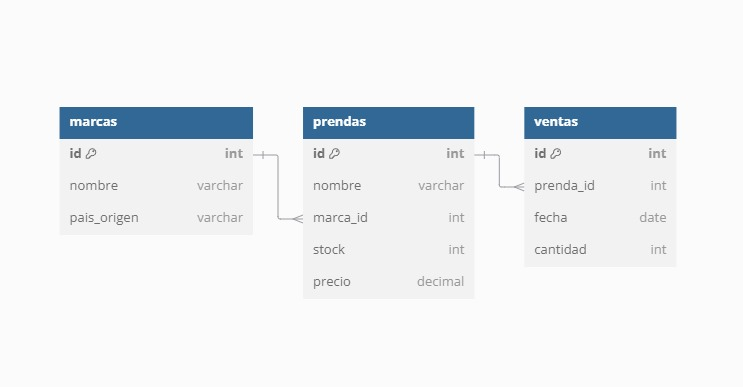

# Tienda de Ropa - Base de Datos

Este proyecto consiste en la creación de una base de datos para una tienda de ropa, que incluye información sobre marcas, prendas y ventas. La base de datos permite la gestión de productos y el análisis de ventas, incluyendo la creación de vistas para obtener las marcas más vendidas y las prendas en stock.

## Estructura de la Base de Datos

La base de datos está compuesta por las siguientes tablas:
Marcas: Información sobre las marcas de ropa.
Prendas: Información sobre las prendas disponibles en la tienda.
Ventas: Información sobre las ventas realizadas.

## Diagrama de la Base de Datos

## Integrantes del Proyecto

- Maria Laura Camacho Herrera
